# Laporan Tugas Modul 4: Jaringan DMZ dan Firewall Fortinet

**Kelompok:** 9-Access Point
**Anggota Kelompok:**
1. [Faruq Awliya Labiib] - [5024241020]
2. [Riggy Fahmi Abyan] - [5024241045]
3. [Dzaky Haady] - [5024241076]

---

## 1. Topologi Jaringan

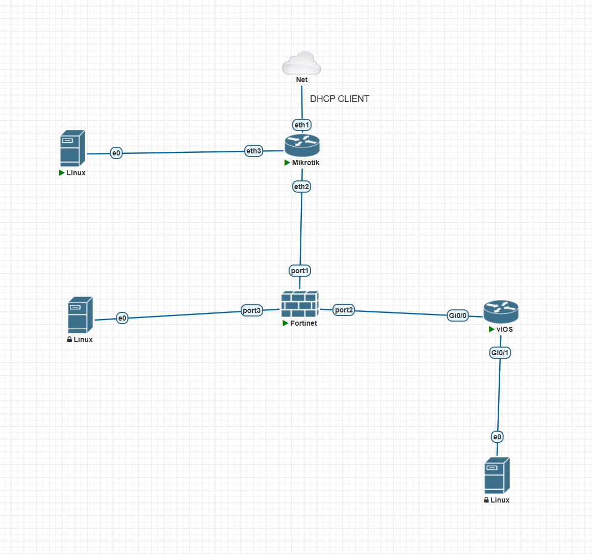

---

## 2. Tabel IP Address

| Perangkat | Interface | IP Address | Gateway | Keterangan |
|:----------|:----------|:-----------|:--------|:-----------|
| MikroTik ISP | ether1 | DHCP Client | DHCP Lab | Terhubung ke Cloud / jaringan lab |
| MikroTik ISP | ether2 | `10.10.10.1/30` | - | Terhubung ke FortiGate port1 |
| MikroTik ISP | ether3 | `172.16.100.1/24` | - | Gateway untuk Client-WAN |
| FortiGate | port1 | `10.10.10.2/30` | `10.10.10.1` | Interface WAN |
| FortiGate | port2 | `10.20.20.1/30` | - | Interface INSIDE ke Cisco |
| FortiGate | port3 | `192.168.20.1/24` | - | Interface DMZ |
| Cisco Router | G0/0 | `10.20.20.2/30` | - | Terhubung ke FortiGate port2 |
| Cisco Router | G0/1 | `192.168.10.1/24` | - | Gateway LAN |
| Client LAN (TinyCore) | eth0 | `192.168.10.10/24` | `192.168.10.1` | Client internal |
| Client WAN (TinyCore) | eth0 | `172.16.100.10/24` | `172.16.100.1` | Client luar |
| Ubuntu Server DMZ | eth0 / ens3 | `192.168.20.10/24` | `192.168.20.1` | Web server DMZ |

---

## 3. Konfigurasi Perangkat

### 3.1. MikroTik ISP
Konfigurasi meliputi pengaturan DHCP Client untuk jalur internet, pemasangan IP address statis, konfigurasi NAT Masquerade, serta Static Route menuju LAN dan DMZ via FortiGate.

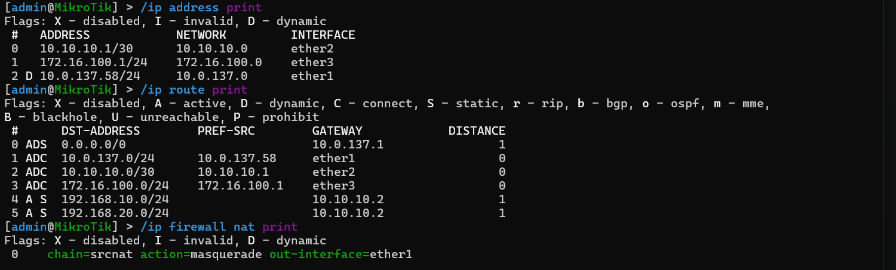

### 3.2. Fortinet FortiGate
Firewall dikonfigurasi dengan menetapkan IP interface, mode statis, pembuatan Address Object, pengaturan Virtual IP (VIP) untuk *port forwarding* HTTP, serta pembuatan tiga Firewall Policy: `LAN_to_WAN`, `LAN_to_DMZ`, dan `WAN_to_DMZ_HTTP`.

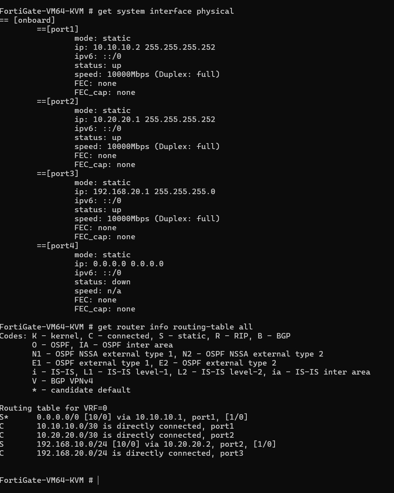
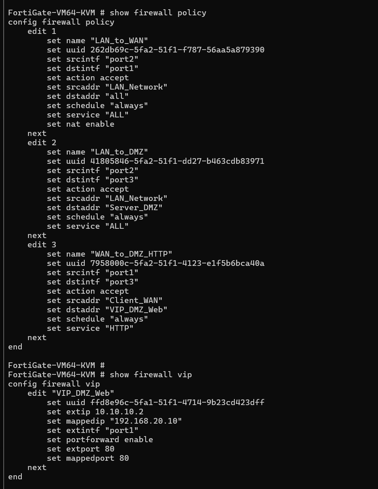

### 3.3. Cisco Router
Konfigurasi IP address pada interface ke arah LAN dan arah Firewall, serta penambahan *Gateway of Last Resort* (Default Route) menuju FortiGate.

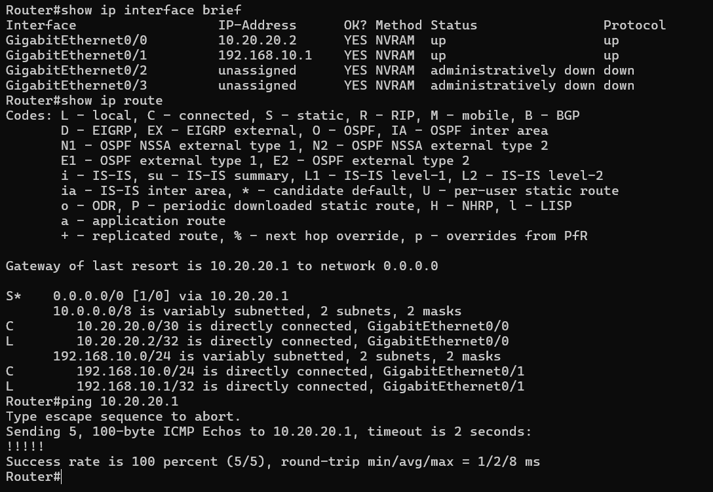

### 3.4. TinyCore Linux (Client LAN & WAN)
Pengaturan IP Address, Default Gateway, dan DNS Server melalui CLI menggunakan `ifconfig` dan `route add`, lalu disimpan permanen menggunakan perintah `filetool.sh -b`.

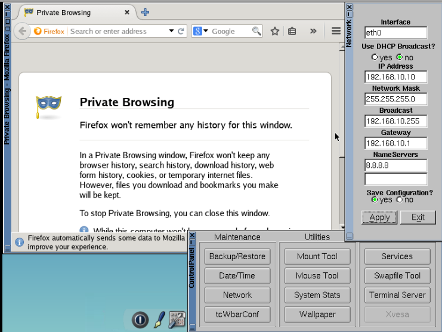
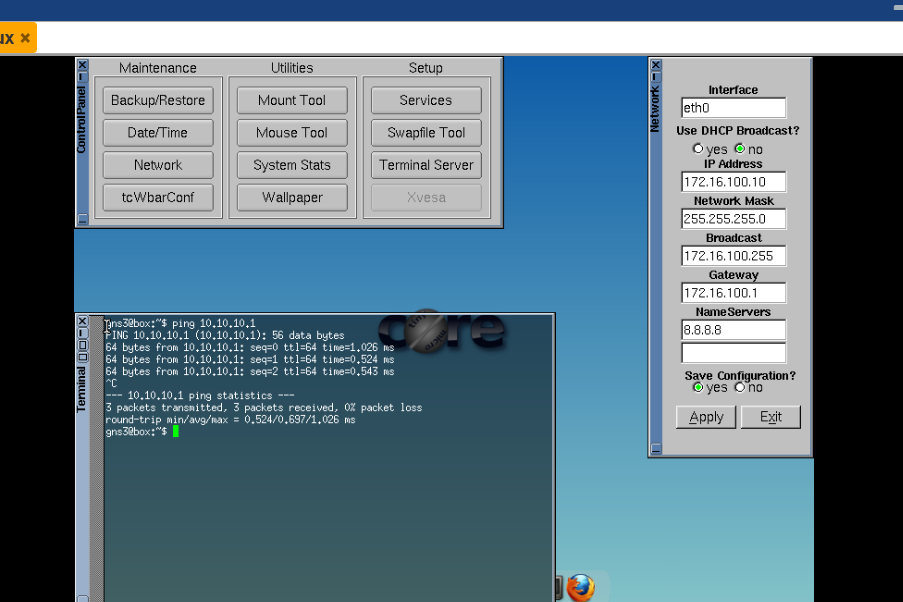

### 3.5. Ubuntu Server DMZ
Pengaturan IP statis menggunakan Netplan, instalasi layanan Nginx Web Server, dan modifikasi file `index.html` sesuai format `Tumod_4_DMZ_Firewall_[No.Kel]-[Nama]`.

---

## 4. Hasil Pengujian

Berikut adalah pembuktian skenario keamanan jaringan berdasarkan *Firewall Policy* yang telah diterapkan:

**1. Pengujian Client LAN ke Gateway Cisco**
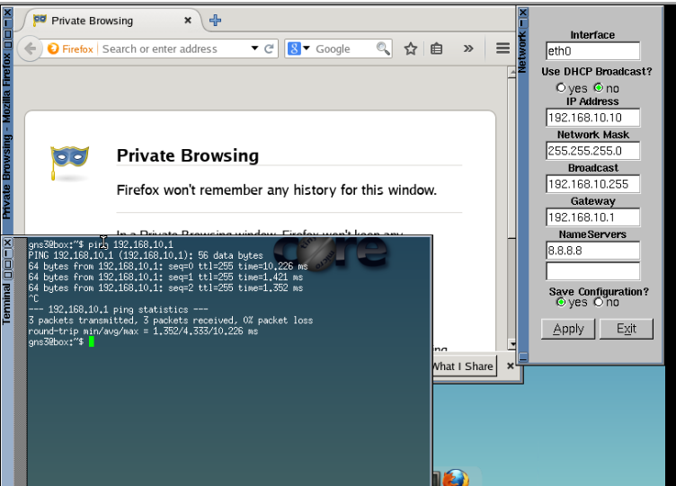

**2. Pengujian Client LAN ke FortiGate**
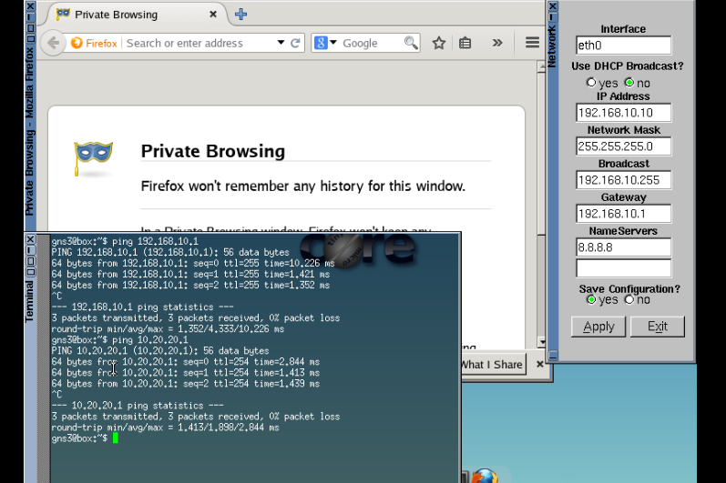

**3. Pengujian Client LAN ke Server DMZ**

**4. Pengujian Client LAN Akses HTTP DMZ**

**5. Pengujian Client WAN Ping ke MikroTik ISP**
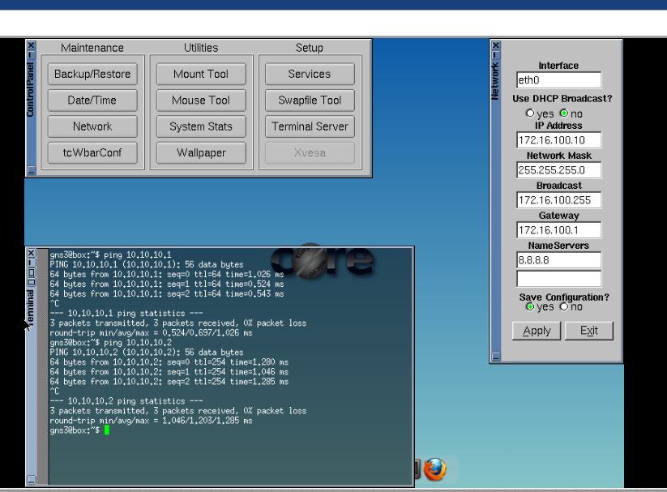

**6. Pengujian Client WAN Ping ke FortiGate**

**7. Pengujian Client WAN Akses HTTP VIP FortiGate (10.10.10.2)**
*(Harus memunculkan halaman web server DMZ)*

**8. Pengujian Client WAN Ping ke Client LAN**
*(Diharapkan: Request Timed Out / Dropped oleh Firewall)*
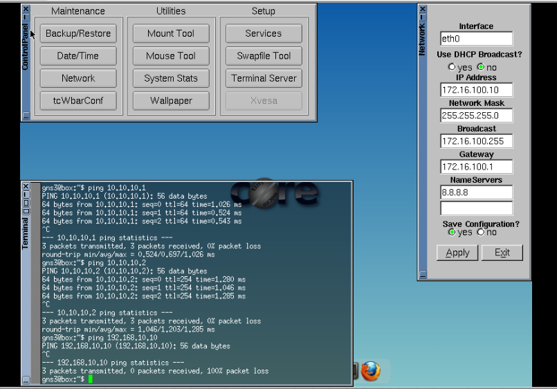

**9. Pengujian Client WAN Ping ke IP Asli DMZ (192.168.20.10)**
*(Diharapkan: Request Timed Out / Dropped oleh Firewall karena harus via VIP)*

**10. Pengujian Server DMZ Ping ke Client LAN**
*(Diharapkan: Berhasil / Reply)*

---

## 5. Analisis dan Kesimpulan

Berdasarkan hasil konfigurasi dan pengujian di atas, dapat disimpulkan bahwa implementasi arsitektur DMZ menggunakan FortiGate telah berhasil memisahkan jaringan menjadi tiga zona dengan tingkat akses yang berbeda:
1.  **Zona INSIDE (LAN):** Memiliki hak akses penuh menuju internet dan layanan server DMZ (dibuktikan dengan berhasilnya akses HTTP dan ping dari LAN ke DMZ). Lalu lintas diterjemahkan menggunakan NAT saat menuju internet.
2.  **Zona OUTSIDE (WAN/Internet):** Sangat dibatasi. Client WAN tidak dapat menjangkau jaringan LAN internal maupun melakukan ping langsung ke IP asli DMZ, sehingga jaringan internal aman dari *scanning* atau serangan luar.
3.  **Zona DMZ (Server Publik):** Layanan publik tetap dapat diakses dari luar (WAN) memanfaatkan fitur **Virtual IP (VIP) / Port Forwarding** di mana publikasi hanya diizinkan melalui protokol HTTP ke IP publik Firewall (10.10.10.2).
